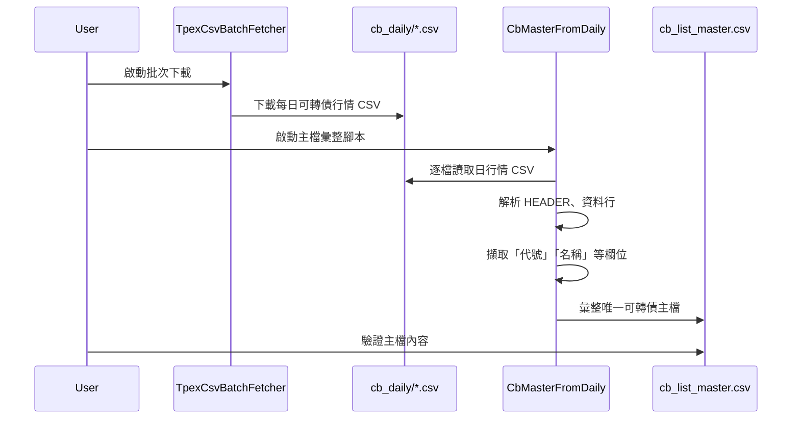

# BCAS Quant Data Pipeline (Phase 1.3 可轉債主檔建置)

## 目錄結構建議

```
data/
├── raw/
│   ├── cb_daily/                # 原始下載的可轉債日行情 CSV（每日日檔，建議依年月分資料夾）
│   │   └── 202501/
│   │       ├── RSta0113.20250101-C.csv
│   │       ├── RSta0113.20250102-C.csv
│   │       └── ...
│   ├── master/
│   │   ├── cb_list_master.csv   # 彙整後的可轉債主檔（由日行情產生）
│   │   └── stock_list.csv       # 上市普通股主檔
│   └── ...                      # 其他原始資料
├── processed/
│   ├── cb_master_clean.csv      # 清洗後可轉債主檔（如有進一步清洗/補充）
│   └── ...                      # 其他處理後資料
└── ...
```

## 流程說明

1. **批次下載日行情 CSV**
   - 腳本：`src/crawlers/daily/tpex_csv_batch_fetcher.py`
   - 存放於：`data/raw/cb_daily/YYYYMM/RSta0113.YYYYMMDD-C.csv`
2. **主檔彙整腳本**
   - 腳本：`src/crawlers/master/cb_master_from_daily.py`
   - 讀取：`data/raw/cb_daily/**/*.csv`
   - 輸出：`data/raw/master/cb_list_master.csv`
3. **後續清洗/補充（如需）**
   - 輸出：`data/processed/cb_master_clean.csv`

## .gitignore 建議

```
# 原始行情大檔與中間檔案不推遠端
data/raw/cb_daily/
data/raw/daily_samples/
data/processed/
*.pyc
__pycache__/
.ipynb_checkpoints/
```

## Mermaid 流程圖



---

## 注意事項

- 請將所有大檔案（如 cb_daily/、daily_samples/、processed/）加入 `.gitignore`，避免推送至遠端。
- 主檔（cb_list_master.csv、stock_list.csv）建議保留於 master/ 目錄，便於版本控管與驗證。
- 若需跨月或全市場彙整，請調整腳本讀取多個年月資料夾。

---# bcas_surgfing
