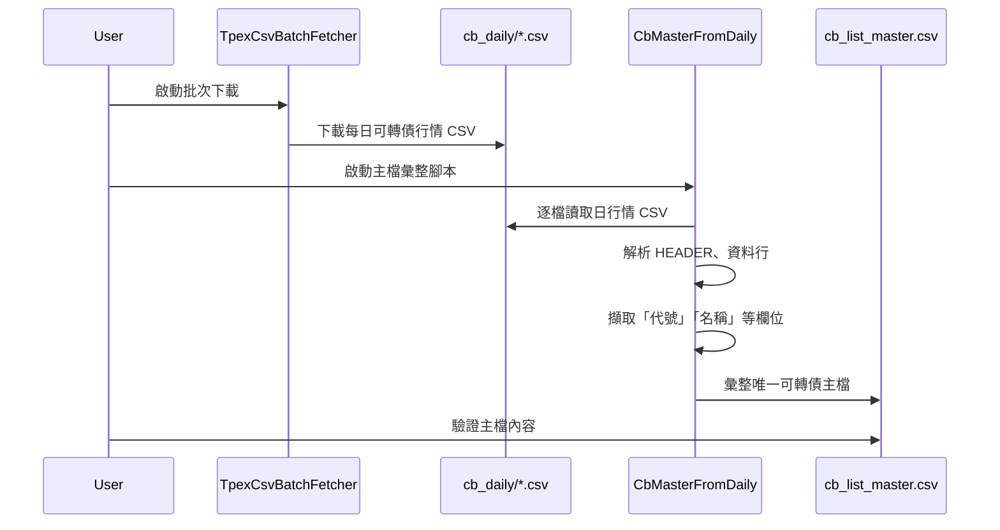

# BCAS Quant Data Pipeline (Phase 1.3 可轉債主檔建置)

> **版本**: v1.3.0 | **狀態**: 開發中 | **最後更新**: 2026-04-13 | **Git 提交**: `bb06b28`

## 目錄結構建議

```
data/
├── raw/
│   ├── cb_daily/                # 原始下載的可轉債日行情 CSV（每日日檔，建議依年月分資料夾）
│   │   └── 202501/
│   │       ├── RSta0113.20250101-C.csv
│   │       ├── RSta0113.20250102-C.csv
│   │       └── ...
│   ├── master/
│   │   ├── cb_list_master.csv   # 彙整後的可轉債主檔（由日行情產生）
│   │   └── stock_list.csv       # 上市普通股主檔
│   └── ...                      # 其他原始資料
├── processed/
│   ├── cb_master_clean.csv      # 清洗後可轉債主檔（如有進一步清洗/補充）
│   └── ...                      # 其他處理後資料
└── ...
```

## 流程說明

1. **批次下載日行情 CSV**
   - 腳本：`src/crawlers/daily/tpex_csv_batch_fetcher.py`
   - 存放於：`data/raw/cb_daily/YYYYMM/RSta0113.YYYYMMDD-C.csv`
2. **主檔彙整腳本**
   - 腳本：`src/crawlers/master/cb_master_from_daily.py`
   - 讀取：`data/raw/cb_daily/**/*.csv`
   - 輸出：`data/raw/master/cb_list_master.csv`
3. **後續清洗/補充（如需）**
   - 輸出：`data/processed/cb_master_clean.csv`

## .gitignore 建議

```
# 原始行情大檔與中間檔案不推遠端
data/raw/cb_daily/
data/raw/daily_samples/
data/processed/
*.pyc
__pycache__/
.ipynb_checkpoints/
```

## Mermaid 流程圖


```mermaid
sequenceDiagram
    participant User
    participant BatchFetcher as TpexCsvBatchFetcher
    participant DailyCsv as cb_daily/*.csv
    participant CBMasterBuilder as CbMasterFromDaily
    participant MasterCsv as cb_list_master.csv

    User->>BatchFetcher: 啟動批次下載
    BatchFetcher->>DailyCsv: 下載每日可轉債行情 CSV
    User->>CBMasterBuilder: 啟動主檔彙整腳本
    CBMasterBuilder->>DailyCsv: 逐檔讀取日行情 CSV
    CBMasterBuilder->>CBMasterBuilder: 解析 HEADER、資料行
    CBMasterBuilder->>CBMasterBuilder: 擷取「代號」「名稱」等欄位
    CBMasterBuilder->>MasterCsv: 彙整唯一可轉債主檔
    User->>MasterCsv: 驗證主檔內容
```

---

## 注意事項

- 請將所有大檔案（如 cb_daily/、daily_samples/、processed/）加入 `.gitignore`，避免推送至遠端。
- 主檔（cb_list_master.csv、stock_list.csv）建議保留於 master/ 目錄，便於版本控管與驗證。
- 若需跨月或全市場彙整，請調整腳本讀取多個年月資料夾。

---

## 專案概覽與版本

**版本**: v1.3.0 (對應 Phase 1.3)  
**狀態**: 開發中  
**最後更新**: 2026-04-13  
**Git 提交**: `bb06b28`

## 變更歷史

### v1.3.0 (2026-04-13)
- 新增可轉債主檔建置流程
- 更新 ETL 處理邏輯 (`fc4b7b8`)
- 新增反爬蟲技巧與下載指南文檔 (`b9896ff`)
- 調整爬蟲輸出路徑與時間函式 (`51f459d`)
- 更新 Makefile 路徑與 init.sql schema (`01e929f`)
- 忽略 docs 目錄下的 CSV 數據檔案 (`bb06b28`)

### v1.2.x (2026-01 ~ 2026-04)
- 各階段開發紀錄見 `docs/agent_context/` 目錄
- 包含 Phase 1.1 至 Phase 1.4 各子階段文件

## 快速開始

1. 克隆專案：
   ```bash
   git clone <repository-url>
   cd bcas_quant
   ```

2. 安裝依賴（建議使用虛擬環境）：
   ```bash
   python -m venv .venv
   source .venv/bin/activate  # Linux/Mac
   # 或 .venv\Scripts\activate  # Windows
   pip install -r requirements.txt
   ```

3. 執行爬蟲：
   ```bash
   python src/crawlers/daily/tpex_csv_batch_fetcher.py
   ```

4. 產生主檔：
   ```bash
   python src/crawlers/master/cb_master_from_daily.py
   ```

## 貢獻與聯絡

### 貢獻指南
請參閱 `CONTRIBUTING.md`（待建立）。歡迎提交 Pull Request 或 Issue。

### 文件目錄
- `docs/agent_context/` - 各階段開發紀錄與上下文
- `docs/agent_framework/` - Agent 架構規劃文件
- `docs/daily_report/` - 團隊工作日誌
- `docs/crawler_architecture/` - 爬蟲架構分析

### 聯絡
- 團隊：BCAS Quant 團隊
- 專案維護：請透過專案 Issue 或團隊內部管道聯絡

---

*本文件最後更新於 2026-04-14*
