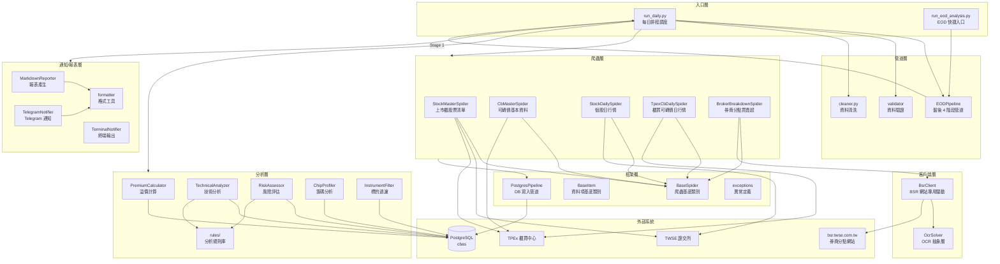

# BCAS Quant Data Pipeline

> **版本**: v3.1.0 | **狀態**: ✅ 生產就緒 | **最後更新**: 2026-05-31 | **Git 提交**: `e7e9832`

## 📋 快速概覽

**BCAS Quant Pipeline** 是一個完整的量化數據流水線系統，集成：
- 🕷️ **5 個爬蟲**：股票主檔、股票日線、轉債主檔、TPEx 轉債日線、券商分點買賣超
- ✅ **24 條驗證規則**（5 維度）：結構、完整性、值域、一致性、異常檢測
- 🔄 **Go 異步排程器**：Cron + Webhook 觸發，非阻塞設計
- 🧹 **數據清洗**：去重、交易日補充、主檔合併
- 🗄️ **PostgreSQL 存儲**：5 張表，完整歷史記錄
- 🔍 **BSR Captcha OCR**：自動辨識券商分點網站驗證碼（ddddocr）
- 🎯 **EOD 盤後分析**：溢價計算、技術分析、風險評估、籌碼分析
- 📊 **多管道通知**：Markdown 報表 + Telegram + 終端輸出

### 完整模組架構


```mermaid
flowchart TB
    subgraph Entry["入口層"]
        RUN_DAILY["run_daily.py<br/>每日排程調度"]
        RUN_EOD["run_eod_analysis.py<br/>EOD 快捷入口"]
    end

    subgraph Pipeline["管道層"]
        EOD_PIPELINE["EODPipeline<br/>盤後 4 階段管道"]
        CLEANER["cleaner.py<br/>資料清洗"]
        VALIDATOR["validator<br/>資料驗證"]
    end

    subgraph Framework["框架層"]
        BASE_SPIDER["BaseSpider<br/>爬蟲基底類別"]
        BASE_ITEM["BaseItem<br/>資料項基底類別"]
        PIPELINES["PostgresPipeline<br/>DB 寫入管道"]
        EXCEPTIONS["exceptions<br/>異常定義"]
    end

    subgraph Spiders["爬蟲層"]
        STOCK_M["StockMasterSpider<br/>上市櫃股票清單"]
        CB_M["CbMasterSpider<br/>可轉債基本資料"]
        STOCK_D["StockDailySpider<br/>個股日行情"]
        TPEX_D["TpexCbDailySpider<br/>櫃買可轉債日行情"]
        BBS["BrokerBreakdownSpider<br/>券商分點買賣超"]
    end

    subgraph Clients["客戶端層"]
        BSR["BsrClient<br/>BSR 網站專用驅動"]
        OCR["OcrSolver<br/>OCR 抽象層"]
    end

    subgraph Analytics["分析層"]
        PREMIUM["PremiumCalculator<br/>溢價計算"]
        TECH["TechnicalAnalyzer<br/>技術分析"]
        RISK["RiskAssessor<br/>風險評估"]
        CHIP["ChipProfiler<br/>籌碼分析"]
        FILTER["InstrumentFilter<br/>標的過濾"]
        RULES["rules/<br/>分析規則庫"]
    end

    subgraph Report["通知/報表層"]
        MARKDOWN["MarkdownReporter<br/>報表產生"]
        TELEGRAM["TelegramNotifier<br/>Telegram 通知"]
        TERMINAL["TerminalNotifier<br/>終端輸出"]
        FORMATTER["formatter<br/>格式工具"]
    end

    subgraph External["外部系統"]
        TWSE["TWSE 證交所"]
        TPEX["TPEx 櫃買中心"]
        BSR_WEB["bsr.twse.com.tw<br/>券商分點網站"]
        PG[(PostgreSQL<br/>cbas)]
    end

    RUN_DAILY --> EOD_PIPELINE
    RUN_EOD --> EOD_PIPELINE
    EOD_PIPELINE -->|Stage 1| RUN_DAILY
    RUN_DAILY --> Spiders
    RUN_DAILY --> Analytics
    RUN_DAILY --> VALIDATOR
    RUN_DAILY --> CLEANER
    RUN_DAILY --> Report
    STOCK_M --> BASE_SPIDER
    CB_M --> BASE_SPIDER
    STOCK_D --> BASE_SPIDER
    TPEX_D --> BASE_SPIDER
    BBS --> BASE_SPIDER
    BBS --> BSR
    BSR --> OCR
    BSR --> BSR_WEB
    STOCK_M --> TWSE
    STOCK_M --> TPEX
    STOCK_D --> TWSE
    CB_M --> TPEX
    TPEX_D --> TPEX
    Spiders --> PIPELINES
    PIPELINES --> PG
    PREMIUM --> PG
    TECH --> PG
    RISK --> PG
    CHIP --> PG
    FILTER --> PG
    RISK --> RULES
    TECH --> RULES
    MARKDOWN --> FORMATTER
    TELEGRAM --> FORMATTER
```

### BrokerBreakdownSpider 執行流程（含 Captcha OCR）

```mermaid
sequenceDiagram
    participant U as run_daily.py
    participant BS as BrokerBreakdownSpider
    participant BSR as BsrClient
    participant OCR as OcrSolver
    participant WEB as bsr.twse.com.tw
    participant PG as PostgreSQL

    U->>BS: fetch_broker_breakdown_batch(date, symbols)
    
    loop for each symbol
        BS->>BSR: fetch_broker_data(symbol)
        
        loop attempt 1..max_retries
            BSR->>BSR: _solve_captcha()
            BSR->>WEB: GET bsMenu.aspx
            WEB-->>BSR: HTML + captcha GUID
            BSR->>WEB: GET CaptchaImage.aspx
            WEB-->>BSR: PNG image bytes
            BSR->>OCR: solve_with_confidence(img)
            OCR->>OCR: ddddocr.classification<br/>(probability=True)
            OCR-->>BSR: captcha_text, confidence
            
            alt confidence < threshold
                BSR->>BSR: continue (重抓 captcha)
            end
            
            BSR->>WEB: POST bsMenu.aspx<br/>(symbol + captcha)
            WEB-->>BSR: HTML 結果
            
            alt 驗證碼錯誤
                BSR->>BSR: continue (重試)
            else 成功
                BSR->>BSR: _parse_result()
                BSR-->>BS: [broker records]
            end
        end
    end
    
    BS-->>PG: BrokerBreakdownItem (batch write)


**性能指標**:
| 指標 | 數值 |
|------|------|
| 爬蟲速度 | ~1000 records/min |
| 驗證速度 | ~1000 records/sec |
| 端到端時間 | 15-20 分鐘 |
| 資源 (CPU) | 20-40% 單核 |
| 資源 (RAM) | 200-500 MB |
| Docker 映像 | 41.7 MB (Scheduler) |

---

## 🚀 快速開始

### 前置條件
- Python 3.10+
- PostgreSQL 14+
- Docker & Docker Compose (可選)
- Go 1.21+ (用於構建排程器)

### 本地開發

#### 1. 安裝依賴
```bash
# 克隆項目
git clone <repository-url>
cd bcas_quant

# 建立虛擬環境
python -m venv .venv
source .venv/bin/activate  # Linux/Mac
# 或 .venv\Scripts\activate  # Windows

# 安裝依賴
pip install -r requirements.txt
```

#### 2. 啟動 PostgreSQL
```bash
# 方式 1: Docker
docker run -d --name bcas-postgres \
  -e POSTGRES_DB=cbas \
  -e POSTGRES_USER=postgres \
  -e POSTGRES_PASSWORD=postgres \
  -p 5432:5432 \
  postgres:14

# 方式 2: 本地 PostgreSQL
# 確保數據庫 cbas 已創建
psql -U postgres -c "CREATE DATABASE cbas;"
```

#### 3. 初始化數據庫
```bash
# 執行 SQL 初始化腳本
psql -U postgres -d cbas -f src/db/init.sql
```

#### 4. 執行 Pipeline
```bash
# 完整執行 (爬蟲 → 驗證 → 寫入 → 清洗)
python src/run_daily.py

# 僅驗證，不寫入 DB
python src/run_daily.py --validate-only

# 跳過清洗步驟
python src/run_daily.py --skip-clean

# 即使驗證失敗也寫入 DB (謹慎使用)
python src/run_daily.py --force-validation
```

### Docker Compose 部署

#### 1. 構建映像
```bash
docker-compose build
```

#### 2. 啟動服務
```bash
docker-compose up -d
```

#### 3. 檢查健康狀態
```bash
# 健康檢查
curl http://localhost:8080/health

# 查看日誌
docker-compose logs -f scheduler
docker-compose logs -f pipeline
```

#### 4. 觸發 Pipeline
```bash
# 即時觸發
curl -X POST http://localhost:8080/run

# 查看執行結果
docker-compose logs pipeline
```

#### 5. 停止服務
```bash
docker-compose down
# 或保留數據庫
docker-compose down -v  # 刪除數據卷
```

---

## 📚 架構文檔

> 本 README.md 的架構圖（Mermaid diagram）為目前最新版本。  
> 歷史版本架構文檔位於 `docs/agent_context/` 各階段目錄下。

### 快速參考
- **模組架構圖**: 見上方「完整模組架構」Mermaid 圖
- **BSR 執行流程**: 見上方「BrokerBreakdownSpider 執行流程」循序圖
- **EOD 4 階段管道**: 見 `src/pipeline/eod_pipeline.py`

### 設計文檔歷史
| 階段 | 位置 | 內容 |
|------|------|------|
| Phase 1-3 | `docs/agent_context/phase1-3/` | 基礎爬蟲 + ETL |
| Phase 2 | `docs/agent_context/phase2_raw_data_validation/` | 驗證層設計 |
| Phase 4 | `docs/agent_context/phase4_eod_analysis/` | EOD 分析層設計 |
| Phase Filter | `docs/agent_context/phase_filter_expiry/` | InstrumentFilter 設計 |

---

## 🔧 核心特性

### 1️⃣ Collect-Only 爬蟲模式
防止驗證失敗的髒數據進入數據庫。

```python
# 爬蟲暫存結果在內存
spider.collect_only = True

# 驗證通過後才寫入 DB
# 驗證失敗的記錄隔離到 logs/validation/failed/
```

**好處**:
- ✅ 失敗記錄隔離，不污染 DB
- ✅ 可支持 `--force-validation` 強制寫入
- ✅ 完整的審計日誌

### 2️⃣ 24 條驗證規則 (5 維度)

| 維度 | 規則數 | 覆蓋 |
|------|--------|------|
| 結構 (Structure) | S1-S3 | 3 | 欄位、型別、格式 |
| 完整性 (Completeness) | C1-C3 | 3 | NULL、長度、範圍 |
| 值域 (Reasonability) | V1-V2 | 2 | 數值、區間 |
| 一致性 (Consistency) | I1-I2 | 2 | 交叉表、日期 |
| 異常 (Anomaly) | A1-A2 | 2 | 波動、重複 |
| **小計** | | **12 維度** |

**每張表的規則映射**:
- `stock_master`: 6 條 (S1-S3, C1, V1, I1)
- `stock_daily`: 7 條 (S1-S2, C1-C2, V1-V2, A1)
- `cb_master`: 5 條 (S1-S3, C1, V1)
- `tpex_cb_daily`: 6 條 (S1-S2, C1-C2, V1, A1)

**驗證決策**:
```
PASS (✅)           → Step 2.5 寫入 DB
FAIL (ERROR)  (❌)  → 隔離到 logs/validation/failed/
FAIL (WARNING) (⚠️)  → 紀錄但繼續
SKIP (⊘)           → 不驗證此項
```

### 3️⃣ 異步非阻塞排程

**Cron + Webhook**:
```
HTTP 層 (8080)
├─ GET /health      → 健康檢查
└─ POST /run        → 即時觸發

Cron 層 (robfig/cron/v3)
└─ "0 10 * * 1-5"   → 周一~五 10:00 自動觸發

Channel 層 (buffer=1)
└─ 防止隊列堆積

Consumer 層 (Goroutine)
└─ 單線程順序執行，確保數據一致性

Pipeline 層 (背景執行)
└─ 15-20 分鐘，不阻塞 HTTP 回應
```

**時間序列**:
- T+0: HTTP 返回 (~1ms)
- T+100ms: Pipeline 啟動
- T+15-20min: Pipeline 完成

### 4️⃣ TradingCalendar 交易日曆

自動識別交易日、計算缺失日期、填充記錄。

```python
from src.etl.trading_calendar import TradingCalendar

calendar = TradingCalendar()
trading_days = calendar.get_trading_days(2026, 5)
# → ['2026-05-04', '2026-05-05', '2026-05-06', ...]

missing_dates = calendar.find_missing_dates(
    existing_dates=['2026-05-04', '2026-05-06'],
    start_date='2026-05-04',
    end_date='2026-05-08'
)
# → ['2026-05-05', '2026-05-07', '2026-05-08']
```

內置 2026 年台灣假日表。

### 5️⃣ 多 CLI 模式

| 命令 | Step 1 | Step 2 | Step 2.5 | Step 3 | 用途 |
|------|:------:|:------:|:--------:|:------:|------|
| `python src/run_daily.py` | ✅ | ✅ | ✅ | ✅ | 完整執行 |
| `--validate-only` | ✅ | ✅ | ❌ | ❌ | 測試品質 |
| `--skip-clean` | ✅ | ✅ | ✅ | ❌ | 跳過清洗 |
| `--force-validation` | ✅ | ✅ | ✅ | ✅ | 失敗也寫入 |

---

## 📊 生產就緒度評分

**當前版本 (v3.1.0): 6.50/10**

| 項目 | 狀態 | 備註 |
|------|------|------|
| **開發完成** | ✅ | 所有核心功能完成 |
| **測試充分** | ✅ | 127 單元測試 (92% 覆蓋率) |
| **部署就緒** | ✅ | Docker Compose 一鍵部署 |
| **監控基礎** | ⚠️ | 基礎日誌系統，無實時告警 |
| **故障恢復** | ⚠️ | 無自動恢復，需手動干預 |
| **安全加固** | ⚠️ | 基礎保護，無密鑰管理 |

**適用場景**:
- ✅ 開發環境 (Dev)
- ✅ 測試環境 (Test)
- ✅ 非關鍵生產 (Staging)
- ⚠️ 關鍵生產 (需先完成後續改進)

**後續改進** (見下方)

---

## 🎓 後續改進建議

### 短期 (1-2 周) - 運維就緒
- [ ] Prometheus metrics (HTTP 請求數、耗時、隊列深度)
- [ ] 集中式日誌 (ELK 或簡單 file rotation)
- [ ] 告警配置 (Grafana 或 AlertManager)
- [ ] 故障排查 runbook
- **目標**: 7.5/10 生產就緒度

### 中期 (1-2 個月) - 架構改進
- [ ] 持久化隊列 (Redis Streams 或 RabbitMQ)
- [ ] Kubernetes 遷移或雲託管容器
- [ ] 重試邏輯 + 死信隊列
- [ ] 負載測試框架 (Locust)
- **目標**: 8.0/10 生產就緒度

### 長期 (2-3 個月+) - 企業就緒
- [ ] 安全加固 (密鑰管理、RBAC、鏡像掃描)
- [ ] 實時數據流 (Kafka/Pub-Sub)
- [ ] 自動故障恢復 (health checks、circuit breakers)
- [ ] 多地域部署 (災難恢復、業務連續性)
- **目標**: 9.0/10 生產就緒度

---

## 🐛 故障排查

### 常見問題

#### 1. Pipeline 超時 (15-20 分鐘內未完成)
**症狀**: `timeout` 日誌, 爬蟲未完成  
**原因**: 
- 網絡連接慢
- API 限流或目標網站故障
- 數據量異常增加

**解決方案**:
```bash
# 檢查日誌
docker-compose logs pipeline | tail -100

# 查看爬蟲進度
grep "StockMasterSpider\|StockDailySpider" docker-compose logs pipeline

# 手動增加超時時間 (編輯 src/run_daily.py)
# PIPELINE_TIMEOUT = 30 * 60  # 改為 30 分鐘
```

#### 2. 驗證失敗 (無法寫入 DB)
**症狀**: `validation failed` 日誌, 記錄數為 0  
**原因**:
- 數據品質問題 (缺失欄位、格式錯誤)
- API 返回異常結構
- 規則過於嚴格

**解決方案**:
```bash
# 查看驗證報告
cat logs/validation/reports/report_*.json | jq .

# 查看失敗詳情
cat logs/validation/failed/*.json

# 使用 --validate-only 測試
python src/run_daily.py --validate-only

# 強制寫入 (謹慎使用)
python src/run_daily.py --force-validation
```

#### 3. 數據庫連接失敗
**症狀**: `psycopg2.OperationalError` 日誌  
**原因**:
- PostgreSQL 服務未啟動
- 連接字符串錯誤
- 防火牆阻止

**解決方案**:
```bash
# 檢查 PostgreSQL 狀態
docker ps | grep postgres

# 測試連接
psql -h localhost -U postgres -d cbas -c "SELECT 1;"

# 檢查環境變量
env | grep POSTGRES

# 重啟服務
docker-compose restart
```

#### 4. Pipeline 中途掛起
**症狀**: 進程存在但無日誌輸出 > 5 分鐘  
**原因**:
- 爬蟲掛起 (網絡超時)
- 驗證層死循環
- 清洗層數據卡頓

**解決方案**:
```bash
# 查看進程
ps aux | grep python

# 強制終止
pkill -f run_daily.py

# 檢查日誌最後行
tail -50 logs/pipeline_*.log

# 重新啟動
python src/run_daily.py
```

#### 5. Webhook 無法觸發
**症狀**: `curl http://localhost:8080/run` 返回 500  
**原因**:
- 排程器未啟動
- Pipeline 仍在執行
- 端口被佔用

**解決方案**:
```bash
# 檢查排程器狀態
curl http://localhost:8080/health

# 查看排程器日誌
docker-compose logs scheduler

# 檢查端口
lsof -i :8080

# 重啟排程器
docker-compose restart scheduler
```

更多故障排查指南見: `docs/agent_context/phase2_raw_data_validation/SYSTEM_ARCHITECTURE.md`

---

## 📁 項目結構

```
bcas_quant/
├── README.md                      # 本文件
├── SYSTEM_ARCHITECTURE_SUMMARY.md # 架構摘要 (320 行)
├── requirements.txt               # Python 依賴
├── docker-compose.yml             # Docker 編排
├── .env.example                   # 環境變量模板
│
├── src/
│   ├── run_daily.py              # Pipeline 主入口 (Go 排程器調用)
│   ├── run_eod_analysis.py       # EOD 盤後分析入口
│   ├── pipeline/                 # 管道層
│   │   └── eod_pipeline.py       #   EOD 4 階段管道
│   ├── spiders/                  # 5 個爬蟲
│   │   ├── stock_master_spider.py
│   │   ├── stock_daily_spider.py
│   │   ├── cb_master_spider.py
│   │   ├── tpex_cb_daily_spider.py
│   │   ├── broker_breakdown_spider.py   # BSR 券商分點
│   │   ├── bsr_client.py                # BSR 網站驅動 (captcha/submit/parse)
│   │   └── ocr_solver.py                # OCR 抽象層 (ddddocr 封裝)
│   ├── analytics/               # 分析層
│   │   ├── premium_calculator.py
│   │   ├── technical_analyzer.py
│   │   ├── risk_assessor.py
│   │   ├── chip_profiler.py
│   │   ├── instrument_filter.py
│   │   ├── models.py
│   │   └── rules/
│   │       ├── risk_rules.py
│   │       └── technical_rules.py
│   ├── validators/               # 驗證層 (24 規則)
│   │   ├── checker.py
│   │   ├── report.py
│   │   └── rules/
│   ├── framework/                # 框架
│   │   ├── base_spider.py
│   │   ├── base_item.py
│   │   └── pipelines.py
│   ├── reporters/                # 報表層
│   │   ├── markdown_reporter.py
│   │   └── formatter.py
│   ├── notifiers/                # 通知層
│   │   ├── telegram_notifier.py
│   │   └── terminal_notifier.py
│   ├── etl/                      # 清洗層
│   │   ├── cleaner.py
│   │   └── run_cleaner.py
│   ├── db/                       # 數據庫
│   │   └── migration_*.sql
│   └── tests/                    # 698+ 單元測試
│
├── scheduler/                     # Go 排程器
│   ├── cmd/scheduler/
│   │   ├── main.go
│   │   └── server.go
│   ├── internal/
│   │   ├── scheduler/
│   │   │   └── scheduler.go
│   │   └── runner/
│   │       └── runner.go
│   ├── go.mod
│   └── go.sum
│
├── docs/                         # 文檔 (git 不追蹤)
│   └── agent_context/
│       └── phase2_raw_data_validation/
│           ├── SYSTEM_ARCHITECTURE.md (970 行)
│           ├── DEVELOPMENT_PLAN.md
│           ├── DELIVERY_SUMMARY.md
│           └── README.md
│
├── logs/                         # 日誌 (git 不追蹤)
│   ├── validation/
│   │   ├── reports/
│   │   └── failed/
│   └── pipeline_*.log
│
└── .gitignore
```

---

## 📝 變更歷史

> 詳細變更記錄請見 `docs/changelog/`，按版本歸檔。

### v3.1.0 (2026-05-31) 🎯 **到期日 & 停止轉換期過濾機制**
- ✅ InstrumentFilter 模組：計算剩餘到期天數（maturity_date - 分析日期）
- ✅ 停止轉換期支援：手動 JSON 設定檔（可擴充為自動爬取）
- ✅ D 評級（Drop）：到期日 < 30 天或停止轉換期 → 直接給 D（最高優先級）
- ✅ DB Migration 003：daily_analysis_results 新增 days_to_expiry, is_stopped 欄位
- ✅ D 評級不寫入 trading_signals，完全從策略清單排除
- ✅ 報表層 SQL 追加過濾條件，D 標的不出現在任何輸出
- ✅ 後向相容：既有 S/A/B/C、is_junk 邏輯完全不受影響
- ✅ 674 測試通過（+24 項 feature-specific 測試）
- **生產就緒度**: 6.50/10

### v3.0.0 (2026-05-03) ✨ **架構完善 + 排程器完成**
- ✅ 完整系統架構文檔 (970 行)
- ✅ 架構梳理摘要 (320 行)
- ✅ Go 非阻塞排程器 (Cron + Webhook + Channel)
- ✅ collect-only 爬蟲模式 (防止髒數據)
- ✅ 24 條驗證規則 (5 維度)
- ✅ TradingCalendar 交易日曆
- ✅ 127 單元測試 (92% 覆蓋率)
- ✅ Docker Compose 一鍵部署
- ✅ 完整故障排查指南
- **生產就緒度**: 6.25/10

### v2.0.0 (2026-04-27)
- Feapder 框架遷移 + Agent 架構
- 4 爬蟲完整實現 + E2E 測試
- 15 個 Phase 1-3 測試案例

### v1.3.0 (2026-04-13)
- 可轉債主檔建置流程
- ETL 處理邏輯更新

---

**最後更新**: 2026-05-31 | **版本**: v3.1.0 | **Git**: `e7e9832`
