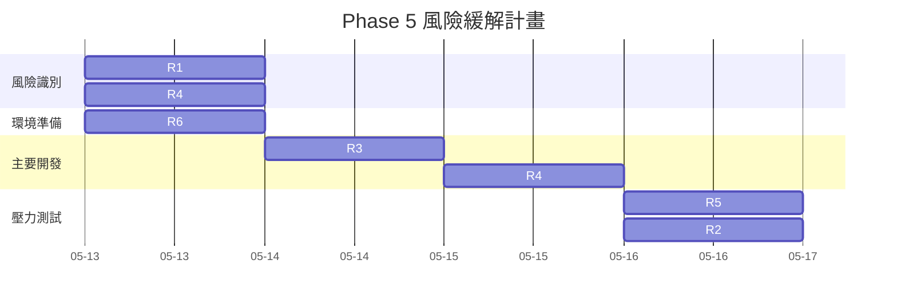
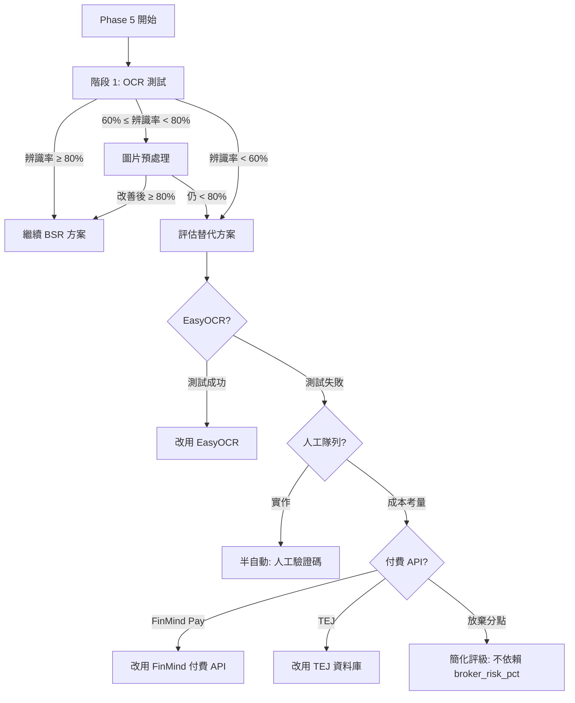

# Phase 5 — 風險評估與應對計畫

---

## 1. 風險矩陣

| ID | 風險描述 | 影響 | 機率 | 嚴重性 | 風險等級 | 觸發條件 |
|----|---------|------|------|--------|---------|---------|
| R1 | ddddocr 辨識率不足 (< 60%) | 無法自動化 | 低 (15%) | 高 | 🟠 **高** | 階段 1 測試結果 |
| R2 | BSR 網站改版/反爬蟲升級 | 流程失效 | 低 (10%) | 高 | 🟠 **高** | 任何時間 |
| R3 | ASP.NET Session/Cookie 管理複雜 | 流程中斷 | 中 (30%) | 中 | 🟡 **中** | 階段 2 開發 |
| R4 | BSR 結果 HTML 結構未知 | 解析困難 | 中 (30%) | 中 | 🟡 **中** | 階段 2.4 |
| R5 | 查詢頻率過高被 BAN | IP 被封 | 中 (25%) | 中 | 🟡 **中** | 批量測試/大量查詢 |
| R6 | ddddocr + onnxruntime 安裝相容性 | 環境問題 | 中 (30%) | 低 | 🟢 **低** | 階段 1.1 |
| R7 | 缺少 ground truth 無法精確評估辨識率 | 誤差較大 | 高 (70%) | 低 | 🟢 **低** | 階段 1.3 |
| R8 | BSR captcha GUID 有時效性 | 驗證碼過期 | 低 (5%) | 低 | 🟢 **低** | 常規執行 |

---

## 2. 詳細風險分析

### R1: ddddocr 辨識率不足

**描述**: ddddocr 預設模型可能不適合 BSR 的特定 Captcha 風格 (噪點、扭曲程度等)，導致辨識率低於 60%。

**影響**:
- 無法實現自動化查詢
- 需要改為半自動或人工介入方案
- 可能導致 Phase 5 目標無法達成

**機率**: 15% — ddddocr 在常見 captcha 上通常有 80%+ 的辨識率

**應對方案**:

| 方案 | 預估改善 | 成本 | 時程影響 |
|------|---------|------|---------|
| **Plan A**: 圖片預處理 (去噪/二值化/銳化) | 可提升 5~15% | 低 (2h) | 小 |
| **Plan B**: 使用 ddddocr 的 `import_onnx_path` 參數切換模型 | 可能提升 5~10% | 低 (1h) | 小 |
| **Plan C**: 使用 EasyOCR (另一個開源 OCR 引擎) 作為備援 | 未知 | 中 (3h) | 中 |
| **Plan D**: 訓練自定義 ONNX 模型 | 可達 90%+ | 高 (大量標註 + 訓練) | 大 |
| **Plan E**: 人工驗證碼隊列 (Terminal UI) | 100% | 中 (4h) | 中 |

**減緩措施**:
1. 若 1st-attempt ≥ 60%: 透過 3~5 次重試可達 > 95% 累計成功率
2. 若 1st-attempt < 60%: 先實施 Plan A (預處理)，再評估
3. 若極端情況 (< 40%): 實施 Plan E (人工隊列) 作為最短時間可用方案

---

### R2: BSR 網站改版/反爬蟲升級

**描述**: TWSE 可能修改 BSR 網站結構、變更 Captcha 機制、或加入 WAF/Cloudflare 等防護。

**影響**:
- 現有流程完全失效
- 需重新逆向工程

**機率**: 10% — BSR 網站已穩定運行多年

**應對方案**:
| 方案 | 成本 |
|------|------|
| 監控 BSR 頁面結構 | 低 (自動化檢查) |
| 備用方案: 恢復 FinMind API (付費方案) | 中 |
| 備用方案: 資料源改為 TEJ 等付費資料庫 | 高 |

**減緩措施**:
1. 實作頁面結構健康檢查 (每日自動檢查 HTML 結構)
2. 維護資料源切換配置，可快速切換到備用方案

---

### R3: ASP.NET Session/Cookie 管理

**描述**: ASP.NET Web Forms 的 `__VIEWSTATE`、`__EVENTVALIDATION`、`__VIEWSTATEGENERATOR` 之間的互動可能比預期複雜，尤其是 Session Timeout 和 ViewState 驗證失敗。

**影響**:
- 開發時間超出預估
- 穩定性問題

**機率**: 30%

**減緩措施**:
1. 階段 1 測試時就驗證完整 POST 流程 (不僅僅是下載 captcha)
2. 實作 `_refresh_session()` 方法可在任何步驟重新初始化
3. 使用 `requests.Session()` 自動管理 Cookie

---

### R4: BSR 結果 HTML 結構未知

**描述**: 目前尚未確認 BSR 回傳結果頁面的 HTML 結構 (表格欄位、CSS class 等)。

**影響**:
- `_parse_result()` 實作需在階段 2 實際測試後才能確定
- 可能需要多次迭代

**機率**: 30% — 基於常見的 ASP.NET 報表模式，結構應有一定的規律性

**減緩措施**:
1. 階段 1 測試中額外提交一次完整的查詢請求，取得結果頁面 HTML
2. 使用 BeautifulSoup 的彈性選擇器 (.find_all("tr") + 欄位比對)
3. 實作欄位名稱啟發式比對 (根據<th>文字內容判斷)

---

### R5: 查詢頻率過高被 BAN

**描述**: 短時間內大量請求 BSR 可能觸發 rate limiting 或 IP 封鎖。

**影響**:
- 測試中斷
- 生產環境中每日任務失敗

**機率**: 25%

**減緩措施**:
| 層級 | 措施 |
|------|------|
| 測試 | 每次請求間隔至少 3 秒 |
| 生產 | 每個 symbol 間隔 2 秒，總查詢數 ≤ 50/次 |
| 監控 | 記錄 HTTP 429/403 狀態碼 |
| IP 輪換 | 必要時可透過 proxy 切換 IP |

---

### R6: ddddocr + onnxruntime 安裝相容性

**描述**: ddddocr 依賴 onnxruntime，在特定 Linux 發行版或 Python 版本上可能出現安裝失敗。

**影響**:
- 環境準備延遲

**機率**: 30% — 常見於 ARM 架構或舊版 glibc

**減緩措施**:
```bash
# 如果 pip install ddddocr 失敗，嘗試:
pip install onnxruntime  # 先裝 runtime
pip install ddddocr      # 再裝 ddddocr

# 或指定 CPU 版本:
pip install onnxruntime-silicon  # Apple Silicon
pip install onnxruntime-rocm     # AMD GPU
```

---

### R7: 缺少 Ground Truth

**描述**: BSR 不提供 captcha 圖片的正確答案，無法精確計算辨識率。

**影響**:
- 辨識率估計有誤差
- 無法區分「格式錯誤」和「內容不正確」

**機率**: 70% (確定存在的問題)

**減緩措施**:
1. 採用**間接驗證**策略: 提交 OCR 結果到 BSR，根據回傳判斷是否成功
   - 成功回傳 = 驗證碼正確
   - 「驗證碼錯誤」頁面 = 驗證碼錯誤
2. **人工抽樣驗證**: 抽取 20% 樣本人工比對，推算整體正確率
3. **字元級正確率**: 比較 OCR 結果與實際提交結果的差異模式

**間接驗證的好處**: 可以通過 BSR 的回應直接判斷 captcha 是否正確，
無需人工標註每張圖片。這比單純的格式檢查 (5碼字母數字) 更精確。

---

## 3. 整體風險緩解時間線



---

## 4. 降級方案決策樹

若 Phase 5 核心方案 (BSR + ddddocr) 不可行，降級路徑如下：



---

## 5. 監控與告警

### 5.1 需監控的指標

| 指標 | 正常範圍 | 告警門檻 | 影響 |
|------|---------|---------|------|
| OCR 辨識率 | ≥ 80% | < 70% (持續 1 天) | 資料品質下降 |
| BSR 回應時間 | < 3s | > 10s (持續 3 次) | BSR 可能異常 |
| HTTP 錯誤率 | < 5% | > 20% | 反爬蟲或網站改版 |
| 每日成功查詢數 | ≥ 50 | < 10 | 流程中斷 |
| Session 刷新成功率 | ≥ 95% | < 80% | Session 管理問題 |

### 5.2 告警方式

| 層級 | 方式 | 適用場景 |
|------|------|---------|
| DEBUG | 日誌記錄 | OCR 辨識率下降 |
| WARNING | Logger warning | 單次查詢失敗 |
| ERROR | Logger error | 連續失敗 |
| CRITICAL | 中斷流程 | BSR 網站無法連線 |

---

## 6. 開發中風險應對預算

| 風險 ID | 預估額外時間 | 應對方案 |
|---------|-------------|---------|
| R1 (低辨識率) | +4h | 圖片預處理 + 重試優化 |
| R2 (BSR 改版) | +6h | 切換到備用資料源 |
| R3 (Session 問題) | +2h | 增加除錯日誌 + 自動恢復 |
| R4 (HTML 解析) | +2h | 彈性選擇器 + 欄位啟發式比對 |
| R5 (被 BAN) | +1h | 延長間隔 + Proxy |
| R6 (安裝問題) | +1h | 多種安裝方式 |
| **總計** | **+16h** | (buffer 時間) |

**建議總預算**: 18h (核心) + 16h (buffer) = **34h** (約 4 個工作日)

---

## 7. 驗收風險檢查清單

在 Phase 5 交付前檢查以下項目:

- [ ] ddddocr 1st-attempt 辨識率 ≥ 80%
- [ ] BSR 完整查詢流程 (session → captcha → submit → parse) 通過
- [ ] 重試機制可正確處理驗證碼錯誤
- [ ] BrokerBreakdownSpider 可正確填入 broker_breakdown 表
- [ ] ChipProfiler 可從 broker_breakdown 讀取資料
- [ ] RiskAssessor 評級中 broker_risk_pct 不為 0 (有資料時)
- [ ] run_daily.py 正常執行且不報錯
- [ ] 請求間隔 ≥ 2s 避免被 BAN
- [ ] HTTP 錯誤有正確的日誌記錄
- [ ] 文件已更新 (此目錄下的所有文件)
