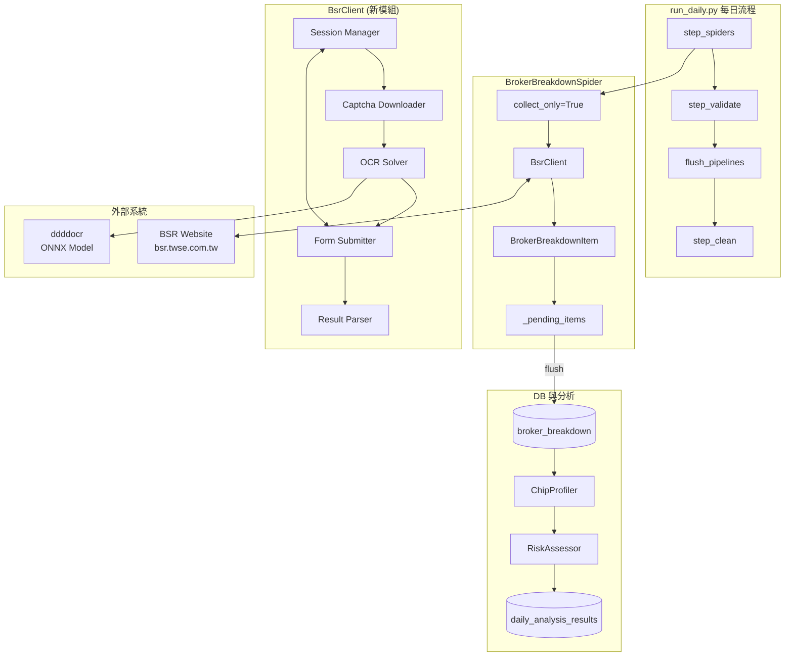
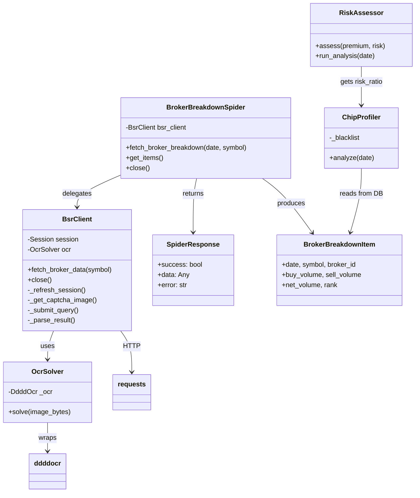
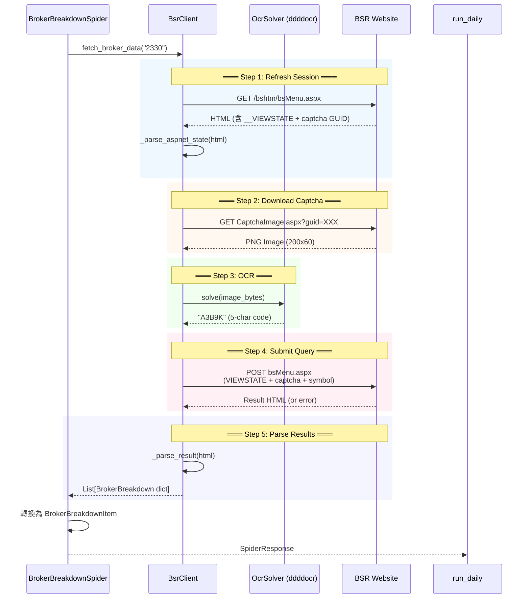
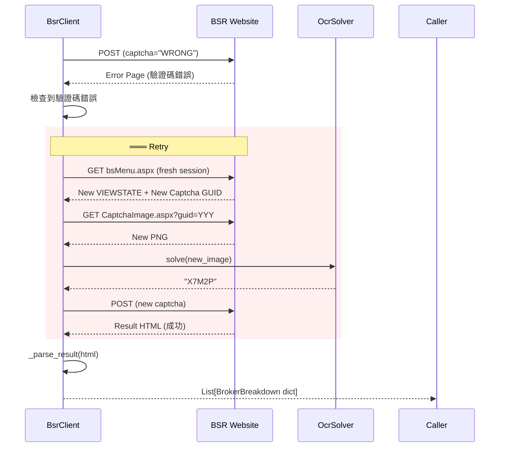
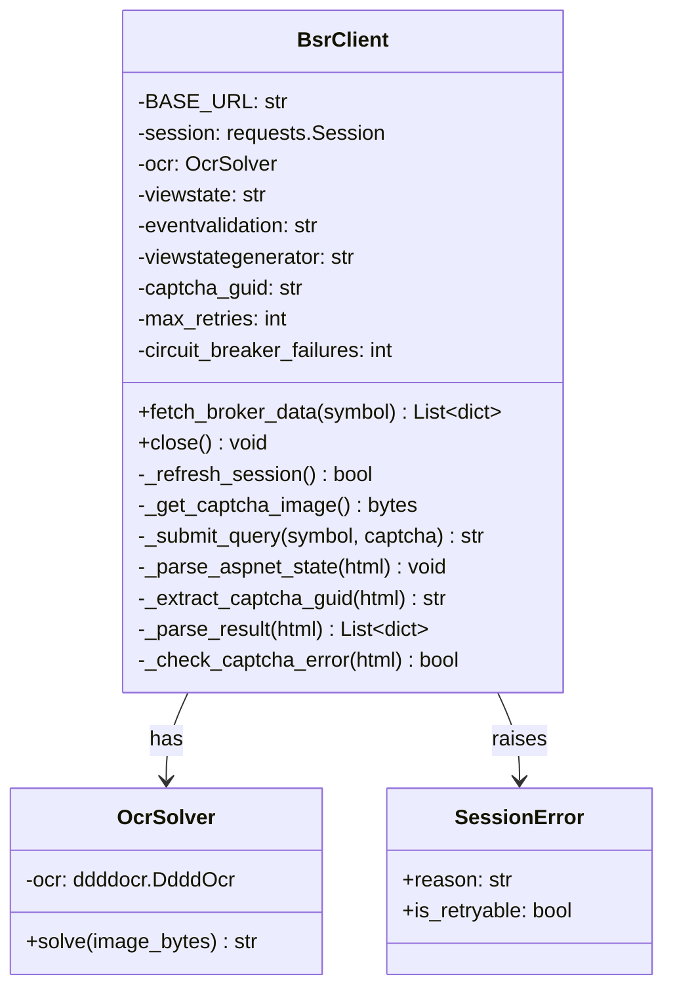
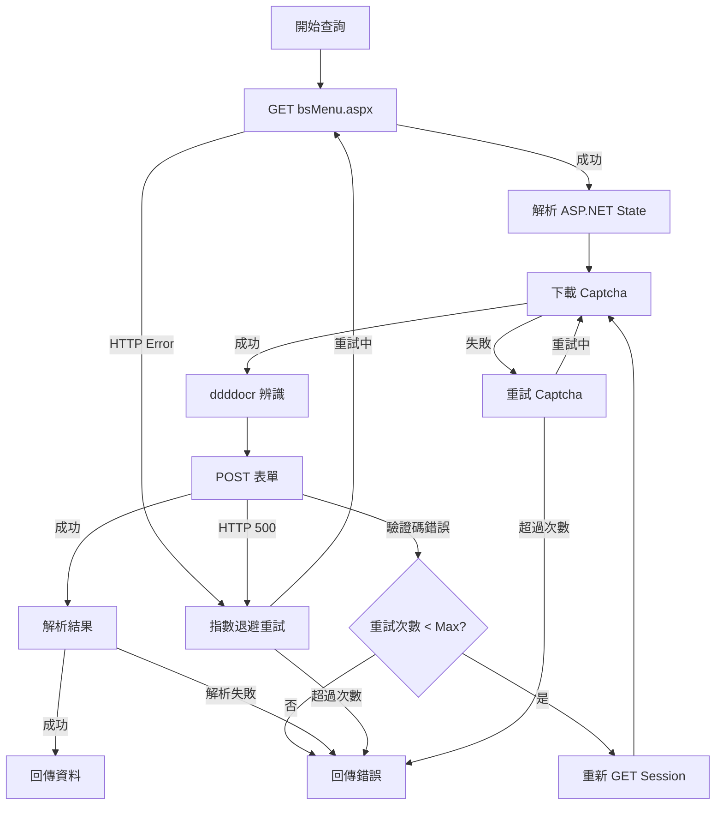
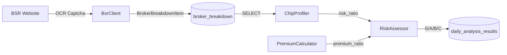

# Phase 5 — BSR Captcha OCR 架構設計

---

## 1. 系統架構概覽

### 1.1 高層次架構



### 1.2 模組依賴關係



---

## 2. BSR 查詢序列流程

### 2.1 正常流程



### 2.2 重試流程 (驗證碼錯誤)



---

## 3. BsrClient 詳細設計

### 3.1 類別圖



### 3.2 關鍵方法規格

#### `fetch_broker_data(symbol: str) -> List[Dict]`

| 項目 | 說明 |
|------|------|
| 輸入 | `symbol`: 股票代號 (如 "2330") |
| 輸出 | `List[Dict]`: BrokerBreakdown 格式 dict 列表 |
| 異常 | `BsrConnectionError`: 網路問題 |
| | `BsrCaptchaError`: 超過最大重試次數 |
| | `BsrParseError`: 結果 HTML 解析失敗 |
| 重試 | 最多 `max_retries` 次 (預設 3) |

#### `_parse_result(html: str) -> List[Dict]`

回傳格式範例:
```python
[
    {
        "broker_id": "9200",
        "broker_name": "凱基-台北",
        "buy_volume": 123456,
        "sell_volume": 78901,
        "net_volume": 44555,
    },
    # ... 共 10 筆 (前 5 買超 + 前 5 賣超)
]
```

**BSR 回傳 HTML 預期結構**:
```html
<!-- 成功查詢後回傳含有表格的完整 HTML -->
<table class="...">
  <tr>
    <td>排名</td>
    <td>券商名稱</td>
    <td>買進股數</td>
    <td>賣出股數</td>
    <td>淨買超</td>
  </tr>
  <tr>
    <td>1</td>
    <td>凱基-台北</td>
    <td>123,456</td>
    <td>78,901</td>
    <td>44,555</td>
  </tr>
  <!-- ... -->
</table>
```

> ⚠️ 以上為預期結構。實際表格欄位與 class 名稱需在階段 1 測試後確認，可能使用 `<frame>` 在 `bsResult.aspx` 中顯示結果。

---

## 4. 錯誤處理策略

### 4.1 錯誤類型與處理



### 4.2 重試次數與 Backoff

| 錯誤類型 | 最大重試 | Backoff 策略 |
|---------|---------|-------------|
| 驗證碼錯誤 | 3 次 | 每次重新 GET session |
| HTTP 500/502/503 | 2 次 | 2s, 4s 指數退避 |
| Network Timeout | 2 次 | 3s, 6s 指數退避 |
| Connection Error | 1 次 | 5s (可能暫時性) |

### 4.3 Circuit Breaker

```python
class BsrCircuitBreaker:
    """BSR 服務電路斷路器"""
    
    FAILURE_THRESHOLD = 5      # 連續失敗次數
    RECOVERY_TIMEOUT = 60       # 恢復等待秒數
    HALF_OPEN_TIMEOUT = 30      # 半開狀態等待秒數
    
    def __init__(self):
        self.failure_count = 0
        self.state = "CLOSED"    # CLOSED / OPEN / HALF_OPEN
        self.last_failure_time = 0
```

---

## 5. OcrSolver 設計

### 5.1 介面

```python
class OcrSolver:
    """ddddocr 封裝，統一的 captcha 解碼介面"""
    
    def __init__(self, gpu: bool = False):
        """
        Args:
            gpu: 是否啟用 GPU 加速 (預設 False，使用 CPU)
        """
        import ddddocr
        self._ocr = ddddocr.DdddOcr(
            # ONNX 模型參數
            # import_onnx_path: Optional[str] = None,  # 自定義模型路徑
            # charsets_path: Optional[str] = None,      # 自定義字元集
            # gpu: bool = False,                        # GPU 加速
        )
    
    def solve(self, image_bytes: bytes) -> str:
        """辨識 captcha 圖片
        
        Args:
            image_bytes: PNG 或 JPEG 圖片資料 (bytes)
        
        Returns:
            辨識結果字串 (BSR Captcha 預期 5 碼)
        """
        return self._ocr.classification(image_bytes)
    
    def solve_with_preprocess(
        self, image_bytes: bytes,
        threshold: int = 128
    ) -> str:
        """先進行圖片預處理再辨識 (用於低辨識率時)"""
        from PIL import Image
        import io
        
        # 1. 轉灰階
        img = Image.open(io.BytesIO(image_bytes)).convert("L")
        
        # 2. 二值化
        img = img.point(lambda x: 255 if x > threshold else 0)
        
        # 3. 轉回 bytes
        buf = io.BytesIO()
        img.save(buf, format="PNG")
        
        # 4. OCR
        return self._ocr.classification(buf.getvalue())
```

### 5.2 預處理策略 (Option)

若 ddddocr 辨識率不足，可加入圖片預處理:
- **灰階化**: PIL `.convert("L")`
- **二值化**: 設門檻值 (如 128) 轉黑白
- **降噪**: OpenCV medianBlur / GaussianBlur
- **銳化**: OpenCV 拉普拉斯算子

預處理將在階段 1 測試後視情況啟用。

---

## 6. BrokerBreakdownSpider 修改摘要

### 6.1 修改點

```python
class BrokerBreakdownSpider(BaseSpider):
    
    def __init__(self, pipeline=None, thread_count=1, redis_key=None, **kwargs):
        super().__init__(...)
        self.pipeline = pipeline
        self.items = []
        self.collect_only = True
        # BSR 客戶端 (lazy init 以節省資源)
        self._bsr_client = None
    
    @property
    def bsr_client(self):
        if self._bsr_client is None:
            from src.spiders.bsr_client import BsrClient
            self._bsr_client = BsrClient()
        return self._bsr_client
    
    def fetch_broker_breakdown(self, date: str, symbol: str) -> SpiderResponse:
        """
        使用 BSR + OCR 取得分點資料
        
        與舊版 API 保持相同簽名:
            - date: YYYYMMDD (BSR 查詢不需要日期參數)
            - symbol: 股票代號
        """
        try:
            records = self.bsr_client.fetch_broker_data(symbol)
            
            self.items.clear()
            for rank, rec in enumerate(records, 1):
                item = BrokerBreakdownItem(
                    date=date,
                    symbol=symbol,
                    broker_id=rec["broker_id"],
                    broker_name=rec["broker_name"],
                    buy_volume=rec["buy_volume"],
                    sell_volume=rec["sell_volume"],
                    net_volume=rec["net_volume"],
                    rank=rank,
                    source_type="bsr",
                    source_url=BsrClient.BASE_URL,
                )
                self.items.append(item)
                self.add_item(item)
            
            return SpiderResponse(
                success=True,
                data={"count": len(self.items)},
            )
        except Exception as e:
            return SpiderResponse(
                success=False,
                error=f"BSR 查詢失敗: {e}",
            )
    
    def close(self):
        """清理資源"""
        if self._bsr_client:
            self._bsr_client.close()
```

### 6.2 相容性保證

| 面向 | 相容性 |
|------|--------|
| 方法簽名 | `fetch_broker_breakdown(date, symbol)` 不變 |
| 回傳類型 | `SpiderResponse` 不變 |
| Item 結構 | `BrokerBreakdownItem` 欄位不變 |
| collect_only | 維持不變 |
| run_daily.py 呼叫 | 完全相容，無需修改 |

---

## 7. RiskAssessor 恢復策略

### 7.1 現狀分析

檢查現有 `RiskAssessor` 原始碼後發現：

| 元件 | 狀態 | 說明 |
|------|------|------|
| `RiskAssessor.assess()` | ✅ 完整 | 已使用 `premium_ratio` + `risk_ratio` |
| `RATING_THRESHOLDS` | ✅ 正確定義 | S/A/B/C 門檻值已存在 |
| `RiskAssessor.run_analysis()` | ✅ 完整 | 已從 `ChipProfiler` 取得 `risk_ratio` |
| `ChipProfiler.analyze()` | ✅ 完整 | 從 `broker_breakdown` 表讀取資料 |
| DB broker_breakdown 表 | ✅ 存在 | schema 不變 |

**結論**: 評級邏輯已就位，**只需確保 BSR 資料正確回填 `broker_breakdown` 表**，RiskAssessor 即可自動恢復完整功能。

### 7.2 資料流



### 7.3 降級策略

若 BSR 查詢失敗 (極端情況):

```python
class RiskAssessor:
    def run_analysis(self, date: str) -> List[Dict]:
        # ... existing code ...
        
        chip_info = chip_results.get(symbol, {})
        risk_ratio = chip_info.get("risk_ratio", 0.0)
        
        # 若 broker_breakdown 無資料，risk_ratio 為 0
        # → 評級只基於 premium_ratio 判斷
        # → 不會擋到 S/A 但 broker_risk_pct 寫 0
```

---

## 8. 整合與部署考量

### 8.1 run_daily.py 修改

**無需修改**。原因：
- `step_spiders()` 中 BrokerBreakdownSpider 的初始化方式不變
- `fetch_broker_breakdown()` 簽名不變
- collect_only + flush 模式不變

### 8.2 依賴套件更新

| 套件 | 用途 | 加入 `requirements.txt` |
|------|------|------------------------|
| `ddddocr` | OCR 辨識 | ✅ 新增 |
| `Pillow` | 圖片處理 | ✅ (ddddocr 相依) |
| `onnxruntime` | ONNX 推論 | ✅ (ddddocr 相依) |

### 8.3 新增檔案

| 檔案 | 說明 |
|------|------|
| `src/spiders/bsr_client.py` | BSR 網站客戶端 (新) |
| `src/spiders/ocr_solver.py` | ddddocr 封裝 (新) |
| `research/backtests/ocr_test/test_bsr_captcha.py` | OCR 測試腳本 (新) |
| `research/backtests/ocr_test/analyze_results.py` | 測試分析腳本 (新) |

### 8.4 修改檔案

| 檔案 | 變更 |
|------|------|
| `src/spiders/broker_breakdown_spider.py` | 改用 BsrClient |
| `requirements.txt` | 新增 ddddocr |

---

## 9. 設計決策記錄

### ADR-1: 使用 requests.Session 而非 feapder 內建 HTTP

**決策**: 使用 `requests.Session()` 管理 BSR Session。

**理由**:
- BSR 需要跨多個請求維持 Cookie
- feapder 內建 HTTP 不適合 ASP.NET Web Forms 的 Session 管理
- `requests.Session` 輕量且成熟

### ADR-2: BsrClient 獨立模組而非內嵌在 Spider

**決策**: BSR 客戶端封裝為獨立 `BsrClient` 類別。

**理由**:
- 單一職責原則
- 可在測試中獨立 mock BsrClient
- 未來可復用於其他需要 BSR 資料的情境

### ADR-3: 使用 ddddocr 預設模型而非自訓練

**決策**: 先測試 ddddocr 預設模型的辨識率，不足才考慮自訓練。

**理由**:
- 自訓練需要大量標註資料 (500+ 張)
- 訓練週期長
- ddddocr 預設模型對這類 captcha 通常已有不錯的表現
