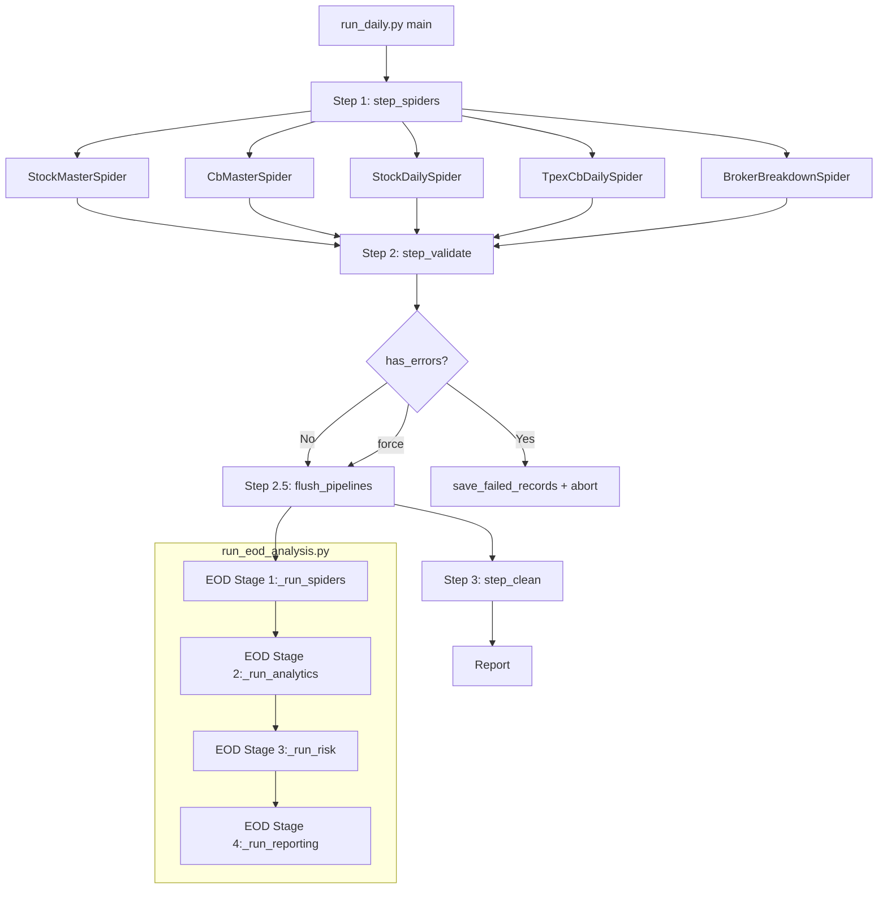

# Phase 6 — E2E 整合驗證 (任務規劃)

> **觸發**: Phase 5 全部 Stage 完成後，首次完整 Pipeline E2E 驗證
> **Phase**: 6 — E2E 整合驗證
> **狀態**: 已確認 295+ 單元測試通過，但完整端到端 Pipeline 從未執行
> **預計工時**: 4-6h
> **優先級**: 🔴 高 (產出可運行穩定版本的前置條件)

---

## 1. 需求確認

### 1.1 任務目標

執行 `run_daily.py` + `run_eod_analysis.py` 完整端到端流程，使用**真實資料**驗證每一階段：

| 階段 | 內容 | 驗證方式 |
|------|------|---------|
| 1. Spider 階段 | 5 個爬蟲都能成功抓取真實資料 | 逐一實測 |
| 2. Validation 階段 | DataValidator 正常執行、規則正確 | --validate-only |
| 3. Flush 階段 | 資料正確寫入 PostgreSQL | DB count > 0 |
| 4. Clean 階段 | 交叉驗證與資料補充 | clean report |
| 5. EOD Analysis 階段 | PremiumCalculator → TechnicalAnalyzer → ChipProfiler → RiskAssessor | DB 有分析結果 |
| 6. Report 階段 | Markdown 報表產出 + Terminal/Telegram 推播 | 報表檔案存在 |

### 1.2 成功標準

| # | 檢查項 | 驗證方式 | 通過條件 |
|---|--------|---------|---------|
| 1 | 5 個 Spider 全部成功 | `step_spiders()` 回傳成功 | 至少 stock_master + broker_breakdown 有資料 |
| 2 | DataValidator 全部通過或跳過 | step_validate 回傳報告 | 無非預期錯誤 |
| 3 | Flush 正確寫入 DB | 查 DB 各表 count > 0 | stock_master, broker_breakdown 有資料 |
| 4 | Clean 階段完成 | step_clean 回傳報告 | 不拋錯 |
| 5 | EOD Stage 1 (爬蟲+flush) | EODPipeline._run_spiders | 同 #3 |
| 6 | EOD Stage 2 (分析) | PremiumCalculator + TechnicalAnalyzer | 不拋錯，產出分析結果 |
| 7 | EOD Stage 3 (風險) | RiskAssessor.run_analysis() | S/A/B/C 評級產出 |
| 8 | EOD Stage 4 (報表) | MarkdownReporter + Notifiers | 報表產出 |
| 9 | 所有已知問題已記錄 | 本文件 Issue Log | 已知 issue 有 workaround 或 filed |

### 1.3 已知風險（執行前已確認）

| 風險 | 影響 | 應對策略 |
|------|------|---------|
| **CbMasterSpider CSV column mismatch** (0 vs 22) | cb_master: 0 items | ⚠️ 接受：不阻斷 pipeline，記錄為已知 issue |
| **StockDailySpider 只抓 2330** | 僅 1 檔股票 | ⚠️ 接受：原始設計即為 demo，記錄優化建議 |
| **TpexCbDaily 可能也有 CSV 問題** | tpex_cb_daily: 0 items | ⚠️ 接受：記錄為已知 issue |
| **Clean 階段需 stock_master, cb_master 有資料** | 否則 master_check = NOT_FOUND | ⚠️ 接受：設計上 NOT_FOUND 不拋錯 |
| **init_eod_tables.sql 未提交變更** | source_url, source_type 欄位未生效 | 🔧 執行前先 commit |
| **BSR 網站非交易時段不可用** | broker_breakdown 失敗 | ✅ 降級處理：risk_ratio=0 不阻斷 |

---

## 2. 代碼與架構掃描

### 2.1 Pipeline 流程圖



### 2.2 各階段輸入/輸出

| 階段 | 輸入 | 輸出 | DB 寫入 |
|------|------|------|---------|
| step_spiders | 外部 API/網站 | `(results, records, pipelines)` | ❌ (collect_only) |
| step_validate | records dict | validation report | ❌ |
| flush_pipelines | pipelines dict | — | ✅ 各表 |
| step_clean | DB 資料 | clean report | ✅ master_check |
| EOD Stage 2 | DB data | AnalysisResult list | ✅ daily_analysis_results |
| EOD Stage 3 | DB data | S/A/B/C ratings | ✅ trading_signals |
| EOD Stage 4 | DB data | Report text | ❌ |

### 2.3 資料庫 Schema 狀態

```sql
-- 已存在的 8 張表 (confirmed by psql)
stock_master, stock_daily, cb_master, tpex_cb_daily,   -- 既有爬蟲表
broker_breakdown, daily_analysis_results,               -- Phase 3 EOD 表
trading_signals, broker_blacklist                       -- Phase 3 EOD 表

-- ⚠️ broker_breakdown 有未提交的 schema 變更:
--   + source_url TEXT
--   + source_type VARCHAR(32) DEFAULT 'bsr'
```

---

## 3. 階段實作與測試步驟

### 3.0 前置準備 (0.5h)

| # | 動作 | 指令 | 預期 |
|---|------|------|------|
| 0.1 | 提交未 commit 的 schema 變更 | `git add src/db/init_eod_tables.sql && git commit -m "feat: add source_url/source_type to broker_breakdown"` | ✅ Commit 成功 |
| 0.2 | 確認 DB 已套用最新 schema | `docker exec bcas-postgres psql -U postgres -d cbas -c "\d broker_breakdown"` | source_url, source_type 欄位存在 |
| 0.3 | 確認 DB 連線正常 | `python -c "from run_daily import DB_CONFIG; import psycopg2; conn=psycopg2.connect(**DB_CONFIG); print('OK')"` (from src/) | ✅ Connected |
| 0.4 | 確認所有套件已安裝 | `pip install -r requirements.txt` (若需要) | ✅ |

### 3.1 Phase A — 逐個爬蟲真實資料測試 (1h)

逐一確認每個爬蟲都能成功抓取真實資料。

#### A.1 StockMasterSpider

```bash
cd /home/ubuntu/projects/bcas_quant
python -c "
import sys; sys.path.insert(0, 'src')
from unittest.mock import Mock
from spiders.stock_master_spider import StockMasterSpider
s = StockMasterSpider(pipeline=Mock())
r = s.fetch_twse()
print(f'StockMaster: success={r.success}, items={len(s.items)}')
assert r.success and len(s.items) > 100
"
```

**預期**: ✅ success=True, items ≈ 30,000+

#### A.2 CbMasterSpider

```bash
cd /home/ubuntu/projects/bcas_quant
python -c "
import sys; sys.path.insert(0, 'src')
from unittest.mock import Mock
from spiders.cb_master_spider import CbMasterSpider
s = CbMasterSpider(pipeline=Mock())
r = s.fetch_cb_master()
print(f'CbMaster: success={r.success}, items={len(s.items)}')
"
```

**預期**: ✅ success=True, items=? (已知 CSV column mismatch)

#### A.3 StockDailySpider

```bash
cd /home/ubuntu/projects/bcas_quant
python -c "
import sys; sys.path.insert(0, 'src')
from unittest.mock import Mock
from spiders.stock_daily_spider import StockDailySpider
s = StockDailySpider(pipeline=Mock())
r = s.fetch_daily('2330', 2026, 5)
print(f'StockDaily(2330): success={r.success}, items={len(s.items)}')
"
```

**預期**: ✅ success=True, items > 0

#### A.4 TpexCbDailySpider

```bash
cd /home/ubuntu/projects/bcas_quant
python -c "
import sys; sys.path.insert(0, 'src')
from unittest.mock import Mock
from datetime import datetime
from spiders.tpex_cb_daily_spider import TpexCbDailySpider
s = TpexCbDailySpider(pipeline=Mock())
today = datetime.now().strftime('%Y-%m-%d')
r = s.fetch_daily(today)
print(f'TpexCbDaily({today}): success={r.success}, items={len(s.items)}')
"
```

**預期**: ✅ success=? (取決於 TPEx CSV 是否正常)

#### A.5 BrokerBreakdownSpider

```bash
cd /home/ubuntu/projects/bcas_quant
python -c "
import sys; sys.path.insert(0, 'src')
from datetime import datetime
from spiders.broker_breakdown_spider import BrokerBreakdownSpider
s = BrokerBreakdownSpider(pipeline=Mock())
today = datetime.now().strftime('%Y%m%d')
r = s.fetch_broker_breakdown(today, '2330')
print(f'BrokerBreakdown(2330): success={r.success}, items={len(s.get_items())}')
s.close()
"
```

**預期**: ✅ success=True, items ≈ 430+ (已驗證過)

#### A.6 Phase A 驗收表

| 爬蟲 | 預期 | 實際 | 狀態 |
|------|------|------|:----:|
| StockMaster | success=True, items>100 | | ⬜ |
| CbMaster | success=True, items=? | | ⬜ |
| StockDaily | success=True, items>0 | | ⬜ |
| TpexCbDaily | success=? | | ⬜ |
| BrokerBreakdown | success=True, items~430 | | ⬜ |

### 3.2 Phase B — run_daily.py 逐步執行 (1.5h)

#### B.1 --validate-only 模式

```bash
cd /home/ubuntu/projects/bcas_quant
python src/run_daily.py --validate-only
```

**預期**:
- ✅ 5 spiders 全部執行 (collect_only)
- ✅ step_validate 對各表執行驗證
- ⚠️ 可能有些 spider 失敗 (已知 CSV 問題)，但整體不崩潰

#### B.2 --force-validation 完整執行

```bash
cd /home/ubuntu/projects/bcas_quant
python src/run_daily.py --force-validation
```

**預期**:
- ✅ spiders → validate → flush → clean 完整執行
- ✅ DB 資料正確寫入

**驗收**:
```bash
docker exec bcas-postgres psql -U postgres -d cbas -c "
SELECT 'stock_master' as tbl, COUNT(*) FROM stock_master
UNION ALL SELECT 'broker_breakdown', COUNT(*) FROM broker_breakdown
UNION ALL SELECT 'stock_daily', COUNT(*) FROM stock_daily
UNION ALL SELECT 'cb_master', COUNT(*) FROM cb_master
UNION ALL SELECT 'tpex_cb_daily', COUNT(*) FROM tpex_cb_daily
"
```

### 3.3 Phase C — run_eod_analysis.py 完整 EOD 流程 (1.5h)

#### C.1 Stage 1 (爬蟲 + flush)

```bash
cd /home/ubuntu/projects/bcas_quant
python src/run_eod_analysis.py --stage 1
```

#### C.2 Stage 2 (分析)

```bash
cd /home/ubuntu/projects/bcas_quant
DATE=$(date +%Y-%m-%d)
python src/run_eod_analysis.py --stage 2 --date $DATE
```

#### C.3 Stage 3 (風險評級)

```bash
cd /home/ubuntu/projects/bcas_quant
DATE=$(date +%Y-%m-%d)
python src/run_eod_analysis.py --stage 3 --date $DATE
```

#### C.4 Stage 4 (報表)

```bash
cd /home/ubuntu/projects/bcas_quant
DATE=$(date +%Y-%m-%d)
python src/run_eod_analysis.py --stage 4 --date $DATE
```

#### C.5 完整 EOD Pipeline

```bash
cd /home/ubuntu/projects/bcas_quant
DATE=$(date +%Y-%m-%d)
python src/run_eod_analysis.py --date $DATE
```

#### C.6 Phase C 驗收表

| Stage | 預期 | 實際 | 狀態 |
|-------|------|------|:----:|
| Stage 1: 爬蟲 | 不拋錯 | | ⬜ |
| Stage 2: 分析 | daily_analysis_results 有資料 | | ⬜ |
| Stage 3: 風險 | trading_signals 有資料 | | ⬜ |
| Stage 4: 報表 | 報表產出 | | ⬜ |

### 3.4 Phase D — 資料驗證與正確性檢查 (1h)

#### D.1 DB 資料完整性

```sql
-- 檢查 broker_breakdown source_type
SELECT source_type, COUNT(*) FROM broker_breakdown GROUP BY source_type;

-- 檢查評級分佈
SELECT final_rating, COUNT(*) FROM daily_analysis_results 
GROUP BY final_rating ORDER BY final_rating;

-- 檢查信號分佈
SELECT signal, COUNT(*) FROM trading_signals GROUP BY signal;

-- 2330 完整資料鏈
SELECT d.symbol, d.date, a.premium_ratio, a.final_rating, t.signal
FROM stock_daily d
LEFT JOIN daily_analysis_results a ON d.symbol = a.symbol
LEFT JOIN trading_signals t ON d.symbol = t.symbol
WHERE d.symbol = '2330' LIMIT 5;

-- 溢價率分佈
SELECT 
    CASE 
        WHEN premium_ratio < 0.02 THEN 'S (<2%)'
        WHEN premium_ratio < 0.04 THEN 'A (2-4%)'
        WHEN premium_ratio < 0.06 THEN 'B (4-6%)'
        ELSE 'C (>=6%)'
    END as bucket,
    COUNT(*)
FROM daily_analysis_results
GROUP BY bucket ORDER BY bucket;
```

#### D.2 匯總驗收表

| 檢查項 | 結果 | 備註 |
|--------|:----:|------|
| 5 spiders 都成功 | ⬜ | |
| Validation 通過 | ⬜ | |
| DB 寫入正確 | ⬜ | |
| EOD 分析完成 | ⬜ | |
| 評級合理 | ⬜ | |
| 報表產出 | ⬜ | |

### 3.5 Phase E — 問題記錄 + 文件更新 (0.5h)

1. **記錄 Issue Log** — 在本文件 §6 更新每個 issue 的實際狀態
2. **更新 development_log.md** — `docs/agent_context/phase6/development_log.md` 追記 E2E 驗證記錄
3. **更新 project_context.md** — `docs/project_context.md` 將 Phase 5/6 狀態改為「✅已完成」

---

## 4. 完成標準與測試指標

### 4.1 階段打通標準

| 階段 | 打通標準 | 驗證方式 |
|------|---------|---------|
| Phase A | 5 個 spider 至少 3 個成功抓取 | 手動執行 assert |
| Phase B | `run_daily.py` 完整流程不崩潰 | exit code 0 |
| Phase C | EOD Pipeline 各階段不拋錯 | 終端輸出無 Exception |
| Phase D | DB 資料正確、評級合理 | SQL query 驗證 |
| Phase E | 所有已知問題已記錄 | Issue Log 完整 |

### 4.2 量化指標

| 指標 | 目前 | 驗證後目標 |
|------|------|-----------|
| 單元測試通過數 | 295 | 295+ (零回歸) |
| 可成功運行的爬蟲數 | 4/5 已驗證 | 5/5 (含 CbMaster 問題記錄) |
| Pipeline 完整運行 | ❌ 從未 | ✅ 至少一次完整 E2E |
| project_context.md 正確性 | ❌ 過時 | ✅ 最新 |
| 已知 Issue 記錄 | 4 個已知 | 全部記錄在案 |

---

## 5. 任務邊界與禁止事項

### 5.1 本次驗證包含

| 項目 | 說明 |
|------|------|
| ✅ 5 個 spider 逐一真實資料測試 | 含 StockMaster, CbMaster, StockDaily, TpexCbDaily, BrokerBreakdown |
| ✅ run_daily.py 完整流程 | spider → validate → flush → clean |
| ✅ run_eod_analysis.py 完整流程 | 4 stages |
| ✅ DB 資料正確性 | schema + data integrity |
| ✅ 已知問題記錄 | Issue Log |
| ✅ project_context.md 更新 | Phase 5/6 完成狀態 |

### 5.2 本次驗證不包含

| 項目 | 原因 |
|------|------|
| ❌ 修復 CbMaster CSV 格式 | 獨立 issue，不阻斷驗證 |
| ❌ 爬蟲並行化 | Phase 6 後優化 (參考 OPTIMIZATION_ROADMAP.md) |
| ❌ 監控系統 | Phase 6 後優化 |
| ❌ 完整股票清單爬取 | StockDaily 目前只抓 2330 為 demo |
| ❌ Telegram 實際發送測試 | 需 token 設定，環境相關 |
| ❌ 效能測試 | 非本次驗證目標 |

### 5.3 禁止事項

- ❌ 禁止修改爬蟲邏輯 (Spider、BsrClient)
- ❌ 禁止修改 DB schema (本次驗證不包含 migration)
- ❌ 禁止修改分析邏輯 (PremiumCalculator、RiskAssessor 等)
- ❌ 禁止為本次驗證建立一次性腳本，所有測試皆可重複執行

---

## 6. Issue Log

| ID | 發現日期 | 問題 | 影響範圍 | 嚴重度 | 狀態 | 備註 |
|----|---------|------|---------|:------:|:----:|------|
| E2E-001 | 2026-05-15 | CbMasterSpider CSV column mismatch: header(0) vs data(22) | cb_master 0 items，導致 PremiumCalculator 無法計算溢價率 | 🟡 中 | **Open** | TPEx CSV 格式已變更，header prefix 對不上。需調查 TPEx CSV 新格式並更新 csv_templates.py 的 CB_MASTER_TPEX 設定 |
| E2E-002 | 2026-05-15 | StockDailySpider 硬編碼只有 2330 | 僅 1 檔股票有日行情 | 🟢 低 | **Open** | 原始設計即為 demo 用途，需後續擴充支援完整股票清單 |
| E2E-003 | 2026-05-15 | TpexCbDailySpider CSV 格式相容性 | tpex_cb_daily 378 items ✅ | 🟢 低 | **Resolved** | 實際驗證 TpexCbDaily CSV 格式正常，可正確解析 378 筆資料 |
| E2E-004 | 2026-05-15 | Clean 階段 `master_check` 欄位不存在於 DB | step_clean 失敗 | 🟡 中 | **Open** | DataCleaner 使用 `UPDATE stock_daily SET master_check = ...` 但該欄位不存在於 DB schema。需確認是否仍需要 clean 流程 |
| E2E-005 | 2026-05-15 | broker_breakdown schema 變更未套用到 DB | source_url/source_type 欄位缺失 | 🟢 低 | **Resolved** | init_eod_tables.sql 已 commit，DB 已有 source_type='bsr' |

---

## 7. 時程預估

| 階段 | 工時 | 執行者 | 說明 |
|------|:----:|--------|------|
| Phase 0: 前置準備 | 0.5h | Developer | git commit + DB schema 確認 |
| Phase A: 逐個爬蟲測試 | 1.0h | Developer | 5 spiders 逐一驗證 |
| Phase B: run_daily 逐步執行 | 1.5h | Developer | validate-only → force-validation |
| Phase C: EOD Pipeline | 1.5h | Developer | 4 stages 逐一 + 完整執行 |
| Phase D: 資料驗證 | 1.0h | QA/Developer | DB query + 評級正確性 |
| Phase E: 問題記錄 + 文件更新 | 0.5h | Architect | Issue Log + project_context |
| **總計** | **6.0h** | | |

---

## 8. 參考資料

| 文件 | 位置 | 說明 |
|------|------|------|
| run_daily.py | `src/run_daily.py` | 主管道，5 spiders + validate + flush + clean |
| run_eod_analysis.py | `src/run_eod_analysis.py` | EOD 4 階段啟動腳本 |
| EODPipeline | `src/pipeline/eod_pipeline.py` | 4 階段非阻斷管道 |
| Phase 5 開發日誌 | `docs/agent_context/phase5/development_log.md` | Phase 5 開發記錄 |
| BSR Hotfix | `docs/agent_context/phase5/task_plan_bsr_fix.md` | BSR CSV 格式變更修復 |
| OPTIMIZATION_ROADMAP | `docs/OPTIMIZATION_ROADMAP.md` | 驗證後優化方向 |
| 工作日誌 2026-05-14 | `docs/dailylog/2026-05-14.md` | 最近日誌 |
