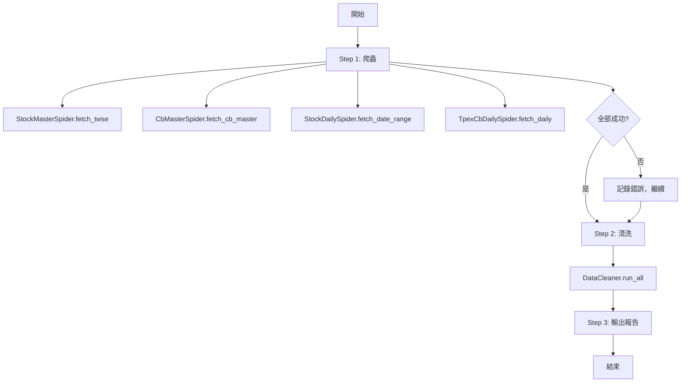

# Phase 5：清理流程建立

## 角色與職責

**你是 Developer Agent**，負責實作爬蟲資料的清理驗證流程。

### 你的工作流程
1. 依照本文件逐步開發與測試
2. 每完成一個任務後，立即更新對應的紀錄文件
3. 嚴格遵守任務邊界與禁止事項
4. **所有測試必須使用真實資料（真實 DB + 真實 spider 產出），禁止 mock 測試**

### 完成定義
- `run_cleaner.py` 可正確執行 stock / CB 日行情 vs 主檔的交叉驗證
- 通過標準：**使用真實 spider 爬取的資料 + 真實 PostgreSQL** 驗證通過
- 所有開發紀錄已更新且完整
- 所有發現的問題已解決或記錄
- 禁止事項無違規

---

## 📂 專案路徑

```
/home/ubuntu/projects/bcas_quant/
```

---

## 📋 開發指引

### 步驟 1: 確認資料庫狀態與資料完整性

在開始開發清洗邏輯之前，先確認資料庫中已有真實的 spider 資料。

#### 執行內容

```bash
# 啟動 PostgreSQL
cd /home/ubuntu/projects/bcas_quant && docker compose up -d timescaledb

# 執行 spiders，將真實資料寫入 DB
python3 -c "
import sys; sys.path.insert(0, 'src')
from framework.pipelines import PostgresPipeline
from spiders.stock_master_spider import StockMasterSpider
from spiders.cb_master_spider import CbMasterSpider

pipeline = PostgresPipeline(host='localhost', port=5432, database='cbas',
                            user='postgres', password='postgres', batch_size=500)

# 抓 TWSE 主檔
s1 = StockMasterSpider(pipeline=pipeline)
r1 = s1.fetch_twse()
s1.close()
print(f'StockMaster: {r1.success}')

# 抓 CB 主檔
s2 = CbMasterSpider(pipeline=pipeline)
r2 = s2.fetch_cb_master()
s2.close()
print(f'CbMaster: {r2.success}')
"

# 確認資料已寫入
python3 -c "
import psycopg2
conn = psycopg2.connect(host='localhost', port=5432, user='postgres', password='postgres', dbname='cbas')
cur = conn.cursor()
cur.execute('SELECT COUNT(*) FROM stock_master')
print(f'stock_master: {cur.fetchone()[0]} 筆')
cur.execute('SELECT COUNT(*) FROM cb_master')
print(f'cb_master: {cur.fetchone()[0]} 筆')
cur.close()
conn.close()
"
```

#### 驗收目標

```
☐ stock_master 至少有 1,000 筆資料（實際約 33,000 筆）
☐ cb_master 至少有 100 筆資料（實際約 340 筆）
☐ PostgreSQL 連線正常
```

**若無真實資料，不可繼續開發。** 不允許用 mock 資料代替。

---

### 步驟 2: 規劃清洗邏輯

#### 清洗規則

**2-1: stock_daily vs stock_master 驗證**

```
輸入: stock_daily (from DB)
比對: stock_daily.symbol 是否存在於 stock_master.symbol

邏輯:
  FOR 每一筆 stock_daily:
    IF symbol 存在於 stock_master:
      → 狀態 = "OK"
      → 可選：補上 stock_master.name, market_type, industry
    ELSE:
      → 狀態 = "NOT_FOUND"
      → 記錄到錯誤清單

輸出:
  - 清洗結果表（含 master_check 欄位）
  - 統計報告（總筆數、OK 數、NOT_FOUND 數）
```

**2-2: tpex_cb_daily vs cb_master 驗證**

```
輸入: tpex_cb_daily (from DB)
比對: tpex_cb_daily.cb_code 是否存在於 cb_master.cb_code

邏輯:
  FOR 每一筆 tpex_cb_daily:
    IF cb_code 存在於 cb_master:
      → 狀態 = "OK"
      → 補上 cb_master.cb_name, conversion_price
    ELSE:
      → 狀態 = "NOT_FOUND"
      → 記錄到錯誤清單（不假設 master 先跑）

輸出:
  - 清洗結果表（含 master_check 欄位）
  - 統計報告（總筆數、OK 數、NOT_FOUND 數）
```

**2-3: 錯誤處理**

- 若主檔查無對應資料 → 標記 `NOT_FOUND`，**不中斷流程**
- 若 DB 連線失敗 → 拋出明確錯誤訊息，**中止流程**
- 若某張表完全沒有資料 → 視為警告，但**不清洗也不中斷**（可能 spiders 還沒跑）

---

### 步驟 3: 實作 `run_cleaner.py`

#### 檔案位置

```
src/etl/run_cleaner.py
```

#### 規格

```python
class DataCleaner:
    """
    爬蟲資料清洗與驗證
    
    功能:
    - stock_daily vs stock_master 交叉驗證
    - tpex_cb_daily vs cb_master 交叉驗證
    - 輸出清洗報告
    
    不假設執行順序，若 master 無對應資料標記 NOT_FOUND 而非失敗。
    """
    
    def __init__(self, db_config: dict):
        """初始化 DB 連線"""
    
    def validate_stock_daily(self) -> dict:
        """驗證 stock_daily 所有 symbol 是否存在於 stock_master"""
    
    def validate_cb_daily(self) -> dict:
        """驗證 tpex_cb_daily 所有 cb_code 是否存在於 cb_master"""
    
    def run_all(self) -> dict:
        """執行全部驗證，回報統計"""
    
    def close(self):
        """關閉資源"""


# CLI 入口
if __name__ == "__main__":
    cleaner = DataCleaner(DB_CONFIG)
    result = cleaner.run_all()
    print(json.dumps(result, indent=2))
    cleaner.close()
```

#### 輸出的清洗報告格式

```json
{
  "stock_daily": {
    "total": 1000,
    "ok": 998,
    "not_found": 2,
    "not_found_details": [
      {"symbol": "XXXX", "date": "2026-04-27"}
    ]
  },
  "tpex_cb_daily": {
    "total": 500,
    "ok": 497,
    "not_found": 3,
    "not_found_details": [
      {"cb_code": "YYYYY", "trade_date": "2026-04-27"}
    ]
  }
}
```

#### 驗收目標

```
☐ run_cleaner.py 可獨立執行（python3 src/etl/run_cleaner.py）
☐ 可正確讀取 DB 中的 stock_daily + stock_master
☐ 可正確讀取 DB 中的 tpex_cb_daily + cb_master
☐ NOT_FOUND 判斷邏輯正確（存在→OK，不存在→NOT_FOUND）
☐ 同時處理空資料表（0 筆）不會 crash
```

**不允許使用 mock DB 或 mock 資料測試此步驟。**

---

### 步驟 4: 實作清洗結果寫入

#### 做法

將驗證結果寫回現有資料表。有兩種方式：

**方式 A（建議）：新增 master_check 欄位到日行情表**

```sql
ALTER TABLE stock_daily ADD COLUMN IF NOT EXISTS master_check TEXT;
ALTER TABLE tpex_cb_daily ADD COLUMN IF NOT EXISTS master_check TEXT;
```

清洗時：
```
stock_daily.master_check = "OK" 或 "NOT_FOUND"
tpex_cb_daily.master_check = "OK" 或 "NOT_FOUND"
```

**方式 B：建立獨立的對照表**

```sql
CREATE TABLE IF NOT EXISTS stock_daily_validation (
    symbol TEXT, date TEXT, master_check TEXT, PRIMARY KEY (symbol, date)
);
CREATE TABLE IF NOT EXISTS tpex_cb_daily_validation (
    cb_code TEXT, trade_date TEXT, master_check TEXT, PRIMARY KEY (cb_code, trade_date)
);
```

#### 驗收目標

```
☐ 清洗結果可寫入 DB（方式 A 或 B 擇一）
☐ 寫入後可 query 確認 master_check 值正確
☐ 同一筆資料重複執行清洗不會產生重複記錄（upsert）
```

**不允許使用 MemoryPipeline 或 CSV 替代真實 DB 寫入驗證。**

---

### 步驟 5: 建立 `run_daily.py` 主控腳本

#### 檔案位置

```
src/run_daily.py
```

#### 規格

```python
"""
每日自動化流程

依序執行：
  1. 爬蟲（spiders）
  2. 清洗（run_cleaner.py）
  3. 輸出報告

用法：
  python3 src/run_daily.py                   # 執行全部
  python3 src/run_daily.py --skip-clean      # 只跑爬蟲
  python3 src/run_daily.py --clean-only      # 只跑清洗
"""
```

#### 執行流程



#### 驗收目標

```
☐ run_daily.py 可完整執行爬蟲 + 清洗流程
☐ 支援 --skip-clean 只跑爬蟲
☐ 支援 --clean-only 只跑清洗
☐ 某個 spider 失敗時不中斷整個流程（記錄錯誤後繼續下一個）
☐ 真實跑一次完整流程，確認 DB 中有正確的 spider 資料 + 清洗結果
```

**此步驟禁止使用任何 mock。必須真實連線 TWSE/TPEx + 真實 DB。**

---

### 步驟 6: 設定排程（可選）

#### 做法

選擇以下任一方式設定每日自動執行：

**方式 A：cron**
```bash
# 每天 09:00 執行完整流程
0 9 * * * cd /home/ubuntu/projects/bcas_quant && .venv/bin/python3 src/run_daily.py >> logs/daily.log 2>&1
```

**方式 B：systemd timer**
```ini
# /etc/systemd/system/bcas-daily.service
[Unit]
Description=BCAS Daily Data Pipeline

[Service]
Type=oneshot
ExecStart=/home/ubuntu/projects/bcas_quant/.venv/bin/python3 /home/ubuntu/projects/bcas_quant/src/run_daily.py
WorkingDirectory=/home/ubuntu/projects/bcas_quant
```

#### 驗收目標

```
☐ 排程設定完成
☐ 可手動觸發一次確認正常執行
```

---

### 步驟 7: 更新紀錄文件

#### 必填文件

1. **`migration_tracker.md`**
   - Phase 5 狀態更新為 ✅ 已完成
   - 填寫完成項目與實際工時

2. **`CONCLUSION_REPORT.md`**（新建於 phase_5_cleaning_pipeline/）
   - 測試結果摘要
   - 清洗統計數據
   - 經驗教訓

---

## 🚫 任務邊界與禁止事項

### 你的職責範圍（可以做）

- ✅ 在 `src/etl/` 下新增 `run_cleaner.py`
- ✅ 在 `src/` 下新增 `run_daily.py`
- ✅ 修改 DB schema（如新增 master_check 欄位）
- ✅ 讀取並參考 `src/spiders/` 的原始碼
- ✅ 使用真實的 PostgreSQL（docker compose 啟動的 timescaledb）
- ✅ 更新 `docs/agent_context/spider_migration_plan/` 下的紀錄文件

### 禁止事項（絕對不可以）

- ❌ **禁止使用 mock 測試** — 所有驗證必須使用真實 DB + 真實資料
- ❌ **禁止只測 interface / parse 層就當作通過** — 必須測到 DB 寫入與查詢
- ❌ **禁止跳過** 任何驗證步驟或自行簡化需求
- ❌ **禁止省略** 開發紀錄或僅口頭驗收
- ❌ **禁止修改** `src/spiders/` 下的爬蟲程式碼
- ❌ **禁止修改** `src/framework/` 下的框架程式碼
- ❌ **禁止** 假設 master 先於 daily 執行（不假設執行順序）
- ❌ **禁止** 未經簽核就標記任務為「完成」

---

## 📋 開發時序總覽

```
Day 1:  確認 DB 資料 + 規劃清洗邏輯
Day 2:  實作 run_cleaner.py + DB 寫入
Day 3:  實作 run_daily.py + 排程設定
Day 4:  完整測試驗證 + 結案
```

---

## 📊 通過標準總表

| 檢查項 | 標準 | 測試方式 |
|--------|------|---------|
| stock_daily 驗證 | 正確比對 stock_master | 真實 DB query |
| tpex_cb_daily 驗證 | 正確比對 cb_master | 真實 DB query |
| NOT_FOUND 標記 | 不存在的主檔正確標記 | 真實 DB query |
| 清洗結果寫入 | master_check 欄位正確 | 真實 DB query |
| run_daily.py 完整流程 | spider + 清洗 + 報告 | 真實連線 + 真實 DB |
| 錯誤處理 | spider 失敗不中斷 | 真實連線 |

---

*此文件由 Developer Agent 建立。*
*版本: 1.0 | 建立: 2026-04-27*
